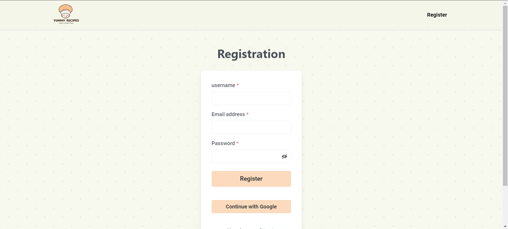
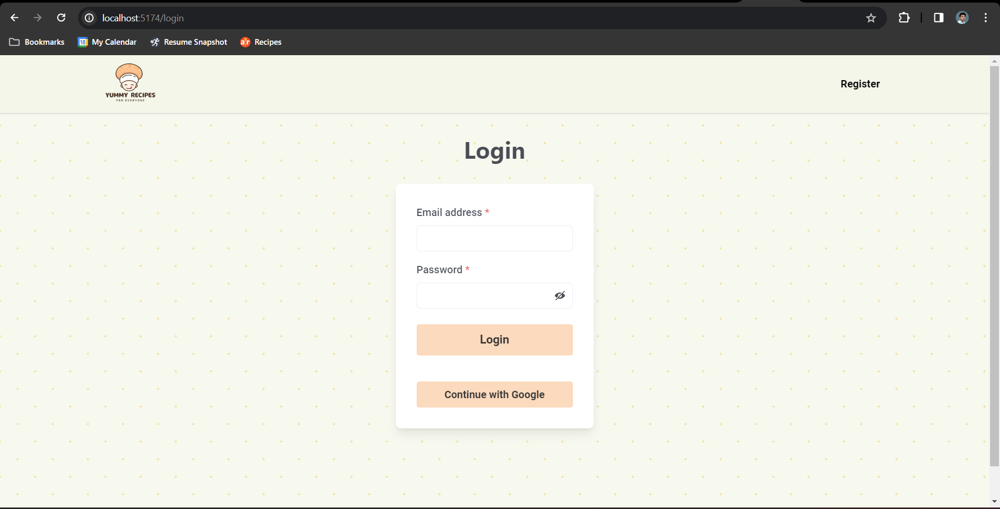
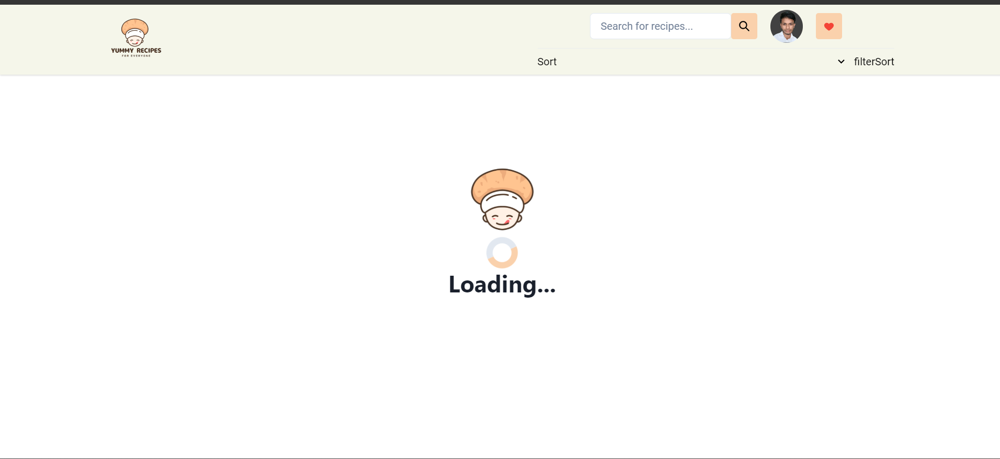
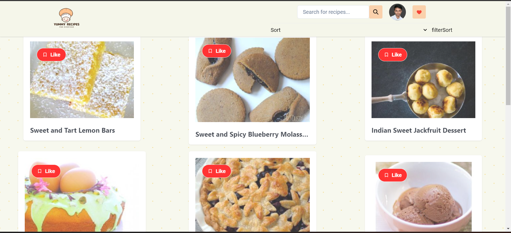

# Yummy-Recipe-Application

Yummy Recipe Application using MERN stack

Certainly! Here's the raw Markdown content for the README file:

````markdown
# Full-Stack Recipe App

Welcome to the Full-Stack Recipe App! This project allows you to create, manage, and discover delicious recipes. Follow the instructions below to set up the project locally and get started.

## Prerequisites

Before you begin, ensure you have met the following requirements:

- Node.js and npm installed
- MongoDB set up and running
- Git installed

## Getting Started

1. Clone the repository to your local machine:

   ```bash
   git clone https://github.com/syedsohel22/Interactive-Recipe-Application.git
   ```
````

2. Install server dependencies:

   ```bash
   npm install
   ```

3. Navigate to the client directory:

   ```bash
   cd frontend
   ```

4. Install client dependencies:

   ```bash
   npm install
   ```

## Environment Variables

Create a `.env` file in the `server/` directory with the following variables: you can check the `sample_env` file in both the server and frontend directories

```env
# for server
MONGO // add your mongoDB URL here
PORT // add your port here
SECRET_KEY // add your secret key here for Json web tokens


# for Frontend
VITE_REACT_APP_API_KEY // add here sponnacular api
VITE_FIREBASE_API_KEY // firebase auth key

```

## Running the App

1. Start the server (from the `server/` directory):

   ```bash
   to run with nodemon
   npm run dev

   to run with node
   npm start
   ```

   The server will run on http://localhost:8000.

2. Start the client (from the `frontend/` directory):

   ```bash
    npm run dev
   ```

   The client will run on http://localhost:5173.

## Frontend Development

To work on the frontend, navigate to the `frontend/` directory and run the development server:

```bash
cd frontend
npm start
```

The frontend server will run on http://localhost:5173.

## Contributing

Feel free to contribute to this project. Please see the [Contributing Guidelines](CONTRIBUTING.md) for more information.

## License

This project is licensed under the [MIT License](LICENSE).

## Screenshots






## Information about Project

# Recipe App

Welcome to the Recipe App! This full-stack application allows you to discover and manage your favorite recipes. Below, you will find information about the app's features and its dependencies.

## Features

### User Authentication

- **Email and Password Login**: Users can register and log in using their email and password.

- **Login with Google**: The app offers the option to sign in using Google accounts for added convenience.

### Security

- **JSON Web Token (JWT)**: We use JWT for secure authentication and authorization of users, enhancing data security.

- **Token Expiry**: User tokens are stored in cookies and have a one-hour expiration to ensure ongoing security.

### Data Persistence

- **Redux Persist**: We leverage Redux Persist to maintain user data and ensure a seamless experience between sessions.

### Recipe Management

- **Create, Edit, and Delete Recipes**: Users can easily add, modify, and remove their recipes.

- **Categorization**: Recipes can be categorized into various types (e.g., breakfast, lunch, dinner) for easy access.

- **Ingredients, Steps, and Images**: Each recipe allows users to provide detailed information, including ingredients, preparation steps, and images.

### Recipe Discovery

- **Search and Filtering**: Users can search for recipes by name, ingredients, or tags. Filters enable users to find recipes based on dietary preferences.

- **Recipe Details**: Recipes are displayed with comprehensive information, including ingredients, preparation steps, and nutritional data.

### User Interaction

- **Favorites and Collections**: Users can save recipes to their favorites and create collections to organize recipes.

## Dependencies

The Recipe App relies on several dependencies and technologies:

- [Node.js](https://nodejs.org/): The JavaScript runtime used for the backend.

- [Express.js](https://expressjs.com/): A web application framework for building the server.

- [MongoDB](https://www.mongodb.com/): The database for storing recipe and user data.

- [React](https://reactjs.org/): The JavaScript library used for the frontend.

- [Redux](https://redux.js.org/): A state management library to handle user data and application state.

- [Redux Persist](https://github.com/rt2zz/redux-persist): Used to persist user data in the client-side storage.

- [JSON Web Tokens (JWT)](https://jwt.io/): Employed for secure user authentication and authorization.

- [Cookie-parser](https://www.npmjs.com/package/cookie-parser): Used for handling and storing user tokens in cookies.

Please refer to the project's package.json file for a complete list of dependencies and versions.

We hope you enjoy using our Recipe App! If you have any questions or feedback, please don't hesitate to reach out.

## Getting Started

To set up and run the Recipe App locally, please refer to the README file provided in the project repository.
